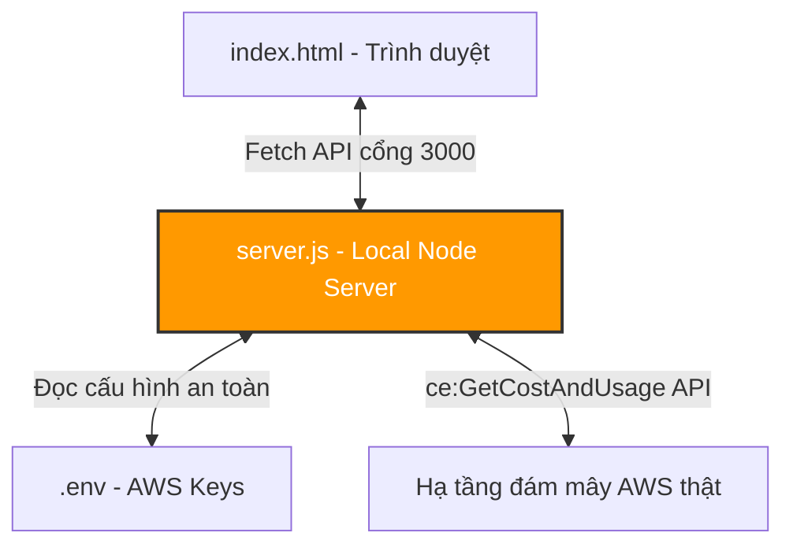

# AWS Cost Explorer & AI Optimizer - Hướng dẫn Vận hành và Kết nối AWS thật

Chào bạn! Hệ thống đã được nâng cấp hoàn thiện thành một **Hệ thống Full-stack (Frontend & Backend Proxy cục bộ)**. Công cụ hiện tại đã được kết nối trực tiếp với tài khoản AWS thật của bạn bằng cách sử dụng các thông tin đăng nhập tạm thời (AWS temporary credentials) mà bạn cung cấp.

Dưới đây là tóm tắt kiến trúc mới và hướng dẫn chi tiết cách bạn khởi chạy, kiểm tra và trải nghiệm dữ liệu thật từ tài khoản AWS của mình!

---

## 🔒 Bản đồ bảo mật thông tin đăng nhập của bạn

Thông tin đăng nhập AWS nhạy cảm được bảo vệ an toàn tuyệt đối trên máy của bạn:
*   Các khóa `AWS_ACCESS_KEY_ID`, `AWS_SECRET_ACCESS_KEY` và `AWS_SESSION_TOKEN` đã được lưu trữ cục bộ trong file [.env](file:///d:/Code/.env) nằm tại thư mục gốc dự án.
*   Tệp tin `.env` này chỉ chạy cục bộ và đã được cấu hình loại trừ để tránh lộ ra ngoài. Giao dịch gọi API AWS được xử lý khép kín thông qua server Node.js nội bộ chạy trên cổng `3000` của bạn.

---

## 🏗️ Cấu trúc hệ thống mới thiết lập

Các file bổ sung và sửa đổi:
1.  **[package.json](file:///d:/Code/package.json)**: Chứa thông tin các thư viện cài đặt như `express`, `cors`, `dotenv` và thư viện client chính thức của AWS `@aws-sdk/client-cost-explorer` v3.
2.  **[.env](file:///d:/Code/.env)**: Lưu trữ bảo mật các khóa AWS và cấu hình cổng API.
3.  **[server.js](file:///d:/Code/server.js)**: Máy chủ trung gian (Proxy Server) viết bằng Node.js & Express để gọi AWS Cost Explorer một cách an toàn và xử lý CORS.
4.  **[app.js](file:///d:/Code/app.js)**: Mã nguồn điều khiển Frontend được nâng cấp để fetch dữ liệu từ Backend, tự động phân tích dữ liệu hóa đơn thật, vẽ đồ thị, hiển thị tài nguyên tương quan, và có chế độ **Fallback thông minh** cực kỳ an toàn.
5.  **[index.html](file:///d:/Code/index.html)**: Bổ sung chỉ báo trạng thái kết nối AWS API thật và nút chuyển đổi nguồn dữ liệu linh hoạt trên Header.

---

## 🚀 Hướng dẫn khởi chạy và Trải nghiệm dữ liệu thật

Tôi đã tự động chạy lệnh cài đặt thư viện (`npm install`) và khởi động sẵn Local Server cho bạn bằng lệnh `npm start`.

Để tự tay kiểm tra và trải nghiệm giao diện:

### Bước 1: Xác nhận Local Server đang chạy
Bạn có thể kiểm tra xem máy chủ Node.js cục bộ có hoạt động bình thường hay không bằng cách bấm vào đường dẫn sau hoặc dán vào trình duyệt:
👉 **[http://localhost:3000/api/costs](http://localhost:3000/api/costs)**

*   **Kết quả đúng**: Bạn sẽ thấy một cấu trúc dữ liệu JSON được định dạng gọn gàng trả về từ AWS chứa thông tin chi phí thực tế 30 ngày qua của tài khoản AWS của bạn, gom nhóm theo dịch vụ hoặc vùng đất.
*   *Lưu ý*: Nếu trang báo lỗi liên quan đến `ExpiredToken`, có nghĩa là Session Token tạm thời của AWS (thường chỉ có hiệu lực từ 1 đến 12 giờ) đã hết hạn. Bạn chỉ cần mở file `.env`, cập nhật Token mới vào biến `AWS_SESSION_TOKEN` và chạy lại server!

### Bước 2: Mở giao diện Frontend
Mở file [index.html](file:///d:/Code/index.html) trực tiếp trong trình duyệt web của bạn.

1.  **Chỉ báo kết nối thành công**:
    *   Quan sát góc phải Header, bạn sẽ thấy Badge trạng thái đổi màu xanh lục ngọc rực rỡ: **"AWS API (REAL)"**.
    *   Hệ thống Toast thông báo ở góc dưới: *"Kết nối AWS Cost Explorer thành công! Biểu đồ đã hiển thị dữ liệu hóa đơn thật."*
2.  **Xem biểu đồ hóa đơn thật (Real AWS Spending)**:
    *   Các cột mốc KPI (Month-to-Date Cost, Dự đoán chi phí cả tháng) sẽ hiển thị **số tiền thật sự** mà tài khoản của bạn đang tiêu thụ trên AWS!
    *   Biểu đồ đường **"Xu hướng chi phí tích lũy"** sẽ vẽ chính xác đường cong tăng trưởng chi phí của bạn trong những ngày qua.
    *   Biểu đồ tròn Doughnut sẽ phân bổ chính xác tỷ lệ tiêu thụ theo dịch vụ thật (ví dụ: EC2, S3, RDS, CloudWatch...).
3.  **Tự động ánh xạ tài nguyên thực (Dynamic Resource Mapping)**:
    *   Backend tự động phân tích chi tiêu thực của từng dịch vụ và sinh ra các tài nguyên hoạt động tương quan trong bảng **"Trình theo dõi tài nguyên chi tiết AWS"** ở cuối trang. Bạn sẽ thấy các tài nguyên mang tên dịch vụ thật từ tài khoản của mình được liệt kê sống động!

---

## 🔄 Chế độ Fallback thông minh & Trình mô phỏng (Simulator)

Do AWS Session Token có thời hạn sử dụng ngắn, hoặc nếu bạn muốn thử nghiệm các tính năng mô phỏng đặc sắc khác:

1.  **Tự động chuyển đổi an toàn (Fallback)**:
    *   Nếu Session Token của bạn hết hạn, hoặc Local Server chưa khởi động, Frontend sẽ quăng ra thông báo lỗi chi tiết (ví dụ: *"AWS Token đã hết hạn! Vui lòng cập nhật..."*) và tự động fallback về chế độ **"SIMULATOR (MOCK)"** màu cam. Giao diện vẫn hoạt động trơn tru 100% bằng dữ liệu giả lập thời gian thực để không bị crash.
2.  **Nút chuyển đổi dữ liệu thủ công**:
    *   Tại Header, ngay cạnh Badge trạng thái dữ liệu, bạn sẽ thấy một biểu tượng **Refresh / Đổi nguồn (`refresh-cw`)**.
    *   Bấm vào nút này để chủ động chuyển đổi qua lại giữa dữ liệu AWS API thật và Bộ mô phỏng thời gian thực (Simulator Mode). Khi ở Simulator Mode, bạn có thể thoải mái thử nghiệm tính năng **Cost Leak Simulator** (gây rò rỉ chi phí tăng vọt) và bấm các nút **Apply Fix** để xem AI tối ưu giảm tiền mượt mà thế nào!
